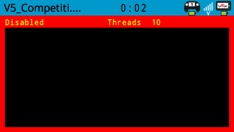
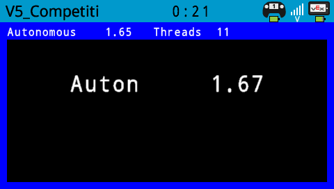
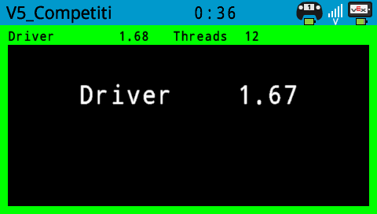

# V5_CompetitionTest

A project for debugging VEXcode competition control issues.   

A C++ class that can be applied to any VEXcode program and show the status of the auton and driver event callbacks.   

The code adds an overlay surrounding the user program output with status.   The large text shown below is output from the actual user program.   

status when disabled   

status in autonomous   

status in driver control   
